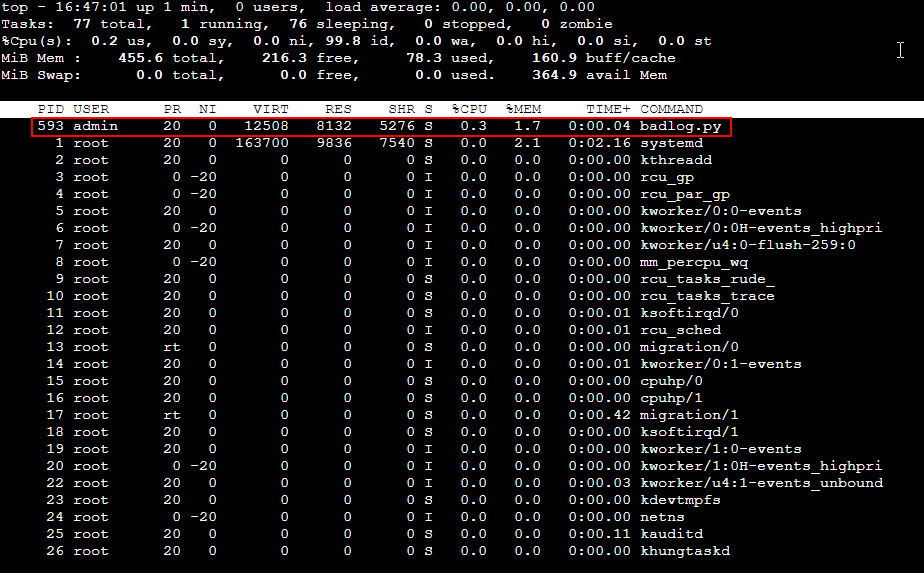

# "Saint John": o que está escrito no arquivo de log?
Link para o desafio: [Link](https://sadservers.com/scenario/saint-john)

## Desafio
### Descrição
Um desenvolvedor criou um programa de testes que escreve continuadamente no arquivo de log `/var/log/bad.log` e está lotando o disco. Você pode checar por um exemplo com o comando: `tail -f /var/log/bad.log`.  
O programa não é mais necessário. Portanto é necessário encontrá-lo e encerrá-lo.
### Teste
O tamanho do arquivo de log não muda (dentro de um intervalo de tempo mais do que a taxa de mudança do arquivo de log).  
O script `/home/admin/agent/check.sh` é usado para validar a solução.

## Solução
A primeira verificação realizada foi a execução do comando `top` para **verificar em tempo real os "processos em execução no Linux"**[^1]. O processo `badlog.py` apareceu entre os processos na lista mostrada pelo utilitário:

Com a saída desse comando, pudemos identificar o processo `badlog.py` com o **ID de processo (PID)** igual a 593. No entanto, não temos a informação do caminho do script para poder verificar o seu conteúdo, ou até excluir o arquivo do programa se não houver mais necessidade de mantê-lo. 
Para obter mais informações sobre os processos executando no sistema, pode ser executado o comando `ps aux`, filtrando com `grep` pelo nome do processo `badlog.py` (usando o pipe `|` para passar o resultado de um comando para o outro). Dessa forma, pode ser encontrado o path completo do script: `/home/admin/badlog.py`. 
> [!NOTE]
> As opções `aux` para o ps são usadas para **"exibir todos os processos do sistema, independente de terminal"**[^2]. Podem ser escritas com ou sem o hífen `-`, que é usado antes das opções na sintaxe dos comandos.

Como possuímos o PID, podemos realizar um comando `kill` para **matar/encerrar a execução do processo**[^3]:

Parar o processo vai fazer com que o programa **pare de escrever no arquivo de log**. Portanto, essa solução vai passar pelo teste de check do desafio, que indica que o tamanho do arquivo de log não pode aumentar dentro do intervalo em que o programa iria escrever nele:

Por fim, a solução foi verificada e o desafio foi dado como concluído com sucesso:

## Referências
[^1]: [Comando top no Linux (lista processos) [Guia Básico] - Certificação Linux](https://www.certificacaolinux.com.br/comando-linux-top/)
[^2]: [ps - Guia Linux](https://guialinux.uniriotec.br/ps/)
[^3]: [Comando Kill: Como Matar Processos no Linux](https://www.hostinger.com.br/tutoriais/comando-kill-linux)