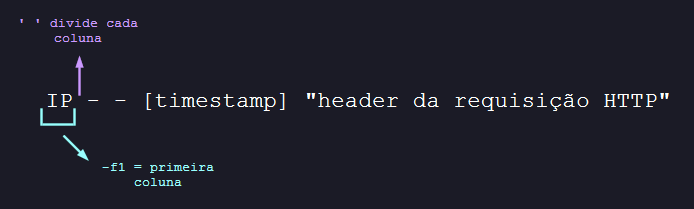

# "Saskatoon": counting IPs.
Link para o desafio: [Link](https://sadservers.com/scenario/saskatoon)

## Desafio
### Descrição
Existe um arquivo de logs de acesso de um servidor web em `/home/admin/access.log`. O arquivo consiste em uma linha para cada requisição HTTP, com o endereço de IP de origem no começo de cada linha.<br>
Encontre qual o endereço de IP que fez a maior quantidade de requisições no arquivo (cada IP é único). Escreva a solução no arquivo `/home/admin/highestip.txt`. Por exemplo, se a sua solução for "1.2.3.4", você pode usar o comando `echo "1.2.3.4" > /home/admin/highestip.txt`.
### Teste
O checksum SHA1 do endereço de IP é `6ef426c40652babc0d081d438b9f353709008e93` (uma maneira de verificar a solução sem descobrir qual é a resposta).

## Solução
Sendo sincera, a maior parte desse desafio foi tentar lembrar muitas coisas que eu havia esquecido e **MUITA** tentativa e erro. Portanto, foi uma experiência que expôs **lacunas importantes que precisam ser revisitadas**, principalmente para a construção de scripts dentro do Linux.<br>
O primeiro passo foi analisar as entradas de logs dentro do arquivo `/home/admin/access.log`, que corresponde à um arquivo muito longo (por isso foram utilizados os comandos ``head e tail``[^1] para leitura, respectivamente, em relação às **primeiras ou últimas linhas** do arquivo) e que em cada entrada consta as informações: 
```
IP - - [timestamp] "header da requisição HTTP"
```


Após várias tentativas falhas e sem conseguir relembrar os comandos que pudessem me auxiliar à tratar esses dados, pedi uma **dica para o desafio**, que me apontou para o comando `cut`:


O comando `cut` pode ser usado para **"mostrar apenas seções específicas de um arquivo de texto ou da saída de outros comandos"**[^2]. No caso do desafio, o comando foi usado para filtrar apenas a primeira coluna de cada entrada de log, que contém os **IPs de origem** da requisição, usando as opções:



- `-d ' '` para separar as colunas pelo caractere espaço, de acordo com o padrão de separação das colunas dos registros de logs
- `-f1` para retornar apenas a primeira coluna separada


Após isso, para esse resultado ser útil para a solução do problema, seria necessário realizar alguma **filtragem nas 1000+ linhas** retornadas com IPs dos logs.<br>
Para provar que eu poderia aprender com as primeiras falhas que cometi, havia encontrado anteriormente uma informação importante que poderia ser usada junto com os resultados que tinha até agora. Ao utilizar o comando `man grep` para **obter opções úteis para o comando** `grep`, recebi a recomendação para consultar o manual do comando `uniq`:


> [!NOTE]
> O comando `man`, abreviação para manual, é uma **"interface usada para visualizar os manuais de referência do sistema"**[^3]. É um dos comandos mais fundamentais para obter informações sobre como executar comandos e características úteis de cada um.

O comando `uniq` **"filtra as linhas adjacentes correspondentes do arquivo de entrada"**[^4], retornando, desse modo, uma saída que "junta" dados repetidos. Com a opção `-c` adicionamos a funcionalidade da saída contar e mostra as linhas repetidas que foram juntadas, fazendo para nós a **soma das linhas com o mesmo IP**:


Por último, o comando que vai tornar possível a utilização do `uniq` com a intenção de contar os IPs e mostrar o IP com o maior , é o utilitário `sort`. Como o nome indica, o comando serve para **"ordena as linhas de arquivos textos"**[^5], sendo aplicado nesse cenário para **juntar os IPs iguais** através de ordenação e, por praticidade ordenar a quantidade de vezes que cada IP aparece do **menor para o maior**.<br>
A ordenação com o `sort` não ocorre por padrão levando em consideração a **ordenação numérica**, sendo necessário utilizar a opção `-n` para isso. Do contrário, vai ordenar pela **ordem de caracteres na tabela ASCII**[^6].<br>
Para juntar todos esses comandos citados anteriormente, foi utilizado o `|` para passar a saída de um comando para a entrada de outro, chegando à:
```
cat /home/admin/access.log | cut -d ' ' -f1 | sort -n | uniq -c | sort -n
```
1. `cat /home/admin/access.log` vai ler todas as linhas do arquivo de logs
2. `cut -d ' ' -f1` vai selecionar apenas a primeira coluna de cada linha, que corresponde ao IP do acesso
3. `sort -n` vai ordenar pela primeira vez a lista de IPs para que o comando do item 4 funciona
4. `uniq -c` vai juntar os IPs iguais (agora que estão devidamente organizados em ordem para permitir que sejam juntados "adjacentemente")
5. `sort -n` é usado uma segunda vez para ordenar a saída final na ordem crescente


> [!TIP]
> No item 5 poderia ter sido usado utilizado o comando `tail -1` para mostrar **apenas a última linha**, que possui o IP com maior recorrência.

O resultado ao rodar o comando formado indica o **IP com a maior ocorrência**, utilizando como referência a contagem de vezes que aparece no arquivo de log:


Para verificar se o IP encontrado corresponde à **resposta correta do resultado**, foi utilizado o comando indicado na descrição do desafio `sha1sum /home/admin/highestip.txt` (calcula o SHA1 do conteúdo do arquivo), que de forma a validar a solução resultou na saída esperada: `6ef426c40652babc0d081d438b9f353709008e93`.


Por fim, a solução foi verificada e o desafio foi dado como concluído com sucesso:


## Melhorias e aprendizados
[ ] - Revisar comandos de manipulação de saídas de texto como `cut`
[ ] - Aprender como utilizar o comando `awk`
[ ] - Aplicar esses conceitos na criação de um script

## Referências
[^1]: [The head and tail commands in Linux](https://www.baeldung.com/linux/head-tail-commands)
[^2]: [Comandos Linux – Comando man](https://www.linuxforce.com.br/comandos-linux/comandos-linux-comando-man/)
[^3]: [Comando cut do Linux](https://somosagility.com.br/comando-cut-do-linux-2/)
[^4]: [sort - Guia Linux](https://www.linuxforce.com.br/comandos-linux/comandos-linux-comando-uniq/)
[^5]: [Comando cut do Linux](https://guialinux.uniriotec.br/sort/)
[^6]: [The “sort” Command in Linux [16 Practical Examples]](https://linuxsimply.com/sort-command-in-linux/)